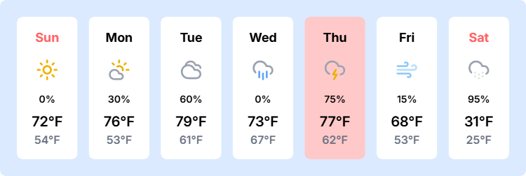

<h1 align="center">
  
   ⛈️static-wx
  
</h1>

<p align="center">
  <a href="https://github.com/crhowell3/static-wx/stargazers">
    
  </a>
  <a href="https://github.com/crhowell3/static-wx/issues">
    
  </a>
  <a href="https://github.com/crhowell3/static-wx/contributors">
    
  </a>
  <a href="#">
    
  </a>
</p>

&nbsp;

## 💭 About

static-wx is a simple React Router Single Page Application (SPA) that takes in
a YAML-formatted configuration file containing 7-day weather forecast data and
produces a downloadable graphic in PNG format.

## 🔰 Getting Started

This application requires `node` and `npm`. All other dependencies will be
downloaded via `npm`.

First, clone this repository:

```shell
git clone git@github.com:crhowell3/static-wx.git
cd static-wx
```

Then, download all the packages with `npm`:

```shell
npm i
```

Finally, run the application:

```shell
npm run dev
```

This will build and run the application, and by default, it can be accessed at
http://localhost:5173 in your web browser.

Here is an example of a forecast graphic that this produces:



<p align="center">
  Copyright &copy; 2025-present
  <a href="https://github.com/crhowell3" target="_blank">Cameron Howell</a>
</p>
<p align="center">
  <a href="https://github.com/crhowell3/static-wx/blob/main/LICENSE"
    ></a>
</p>